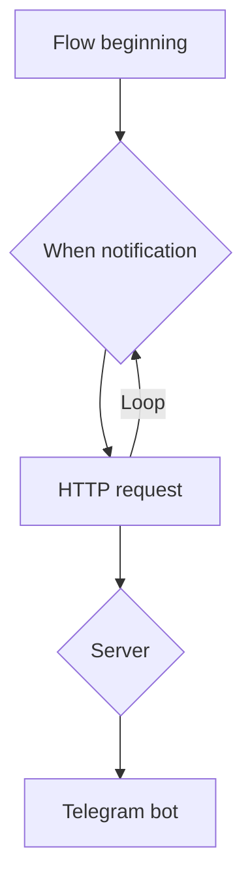
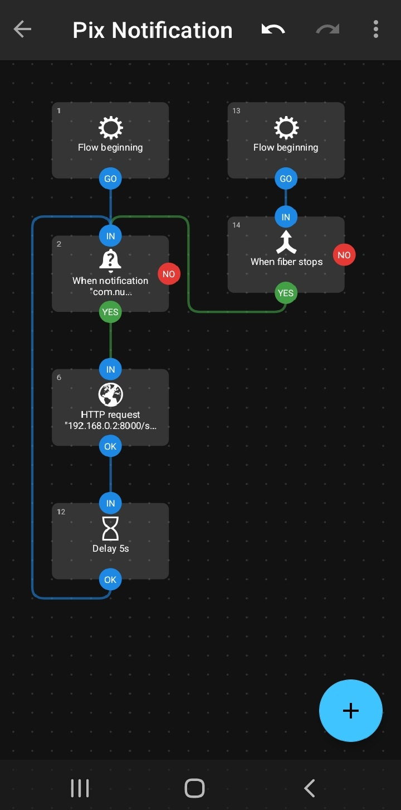

# O que é o Pix Notification?

É uma automação do Telegram que utiliza um bot para enviar, em um grupo de conversa específico, uma notificação sempre que um Pix é recebido.

A ideia surgiu como uma forma de facilitar o controle de pagamentos sem a necessidade de acessar o telefone onde o aplicativo bancário está instalado.

### Como funciona?
O fluxo da automação começa a partir de um aplicativo chamado [Automate](https://play.google.com/store/apps/details?id=com.llamalab.automate&hl=pt_BR), que monitora as notificações do celular. Quando uma notificação do banco é detectada, ele captura a informação e dispara uma requisição HTTP para um servidor.

Esse servidor, por sua vez, utiliza um bot para enviar uma mensagem em um grupo do Telegram.


### Como usar?
- Primeiro clone este repositorio para sua maquina local. 
- Em seguida crie um arquivo ***.env*** no diretorio raiz (onde fica o arquivo pyproject.toml) com as seguintes variaveis:

```plaintext
CHAT_ID="your-chat-id"
API_TOKEN="your-token"
```
Se não sabe onde obter o **CHAT_ID** e **API_TOKEN**, [clique aqui](https://gist.github.com/nafiesl/4ad622f344cd1dc3bb1ecbe468ff9f8a).

- Com o ambiente virtual ativado, execute o seguinte comando no terminal:
```bash
uvicorn --host 0.0.0.0 src.pix_notification.app:app
```


- No celular onde o aplicativo do banco está instalado, baixe e instale o [Automate](https://play.google.com/store/apps/details?id=com.llamalab.automate&hl=pt_BR).  
- Crie e inicie o fluxo de automação com base no diagrama acima:



O Automate irá capturar notificações com base no título configurado no bloco When notification (Notification posted?) e enviá-las para o endpoint do seu servidor local, configurado no bloco HTTP request.

#### Mais informaçoes sobre o Automate
- Vídeo tutorial em [português](https://www.youtube.com/watch?v=JOR6CWTZfC0&list=PLZuqFh2Wzucy689lACCoaMTRjpKDGtPOC&index=1).
- Vídeo tutorial em [inglês](https://www.youtube.com/watch?v=p3tXhB6xAYw).